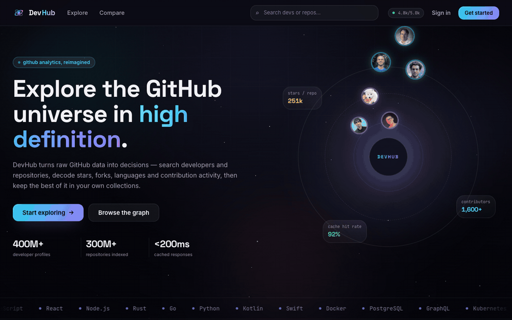
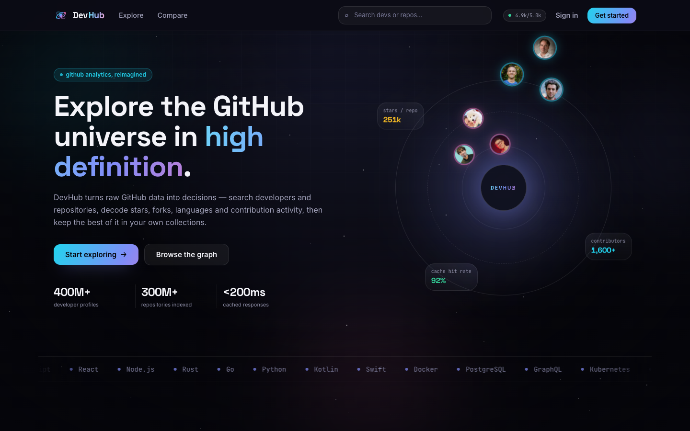
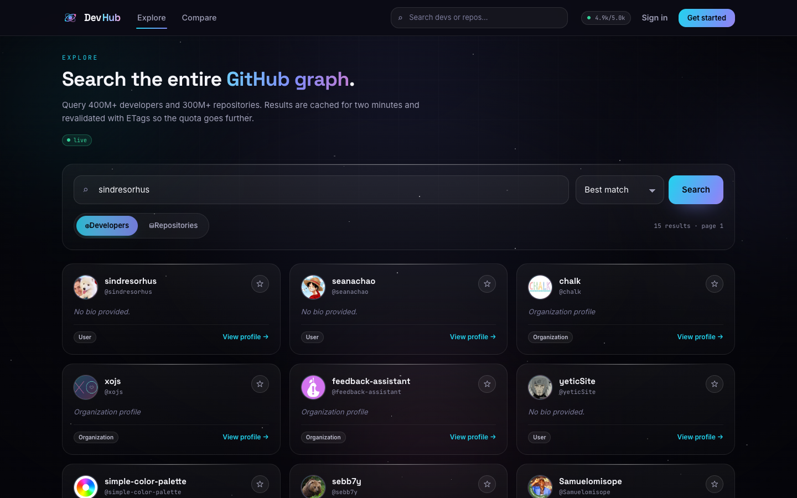
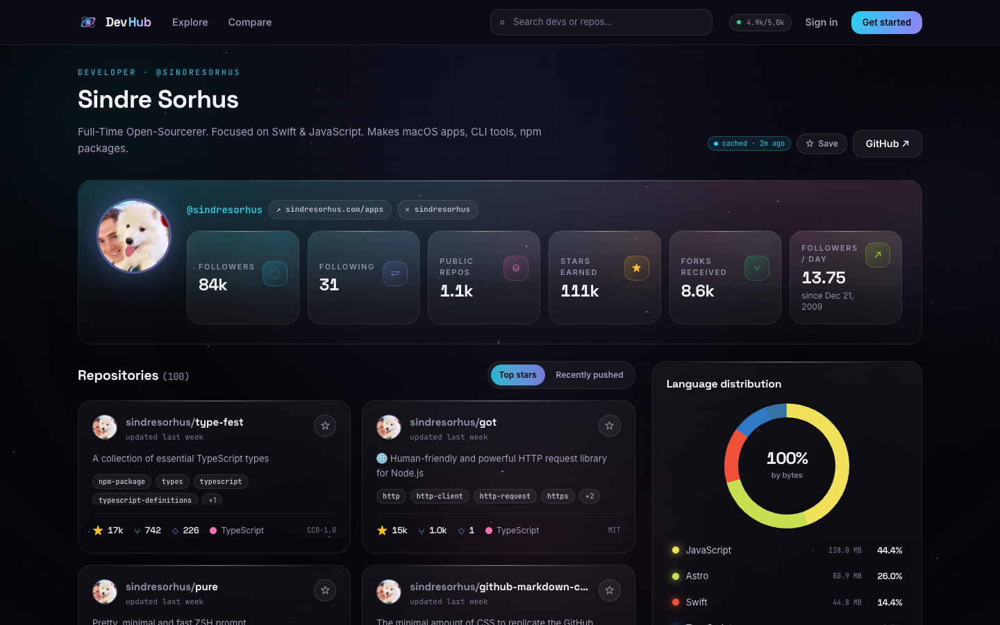
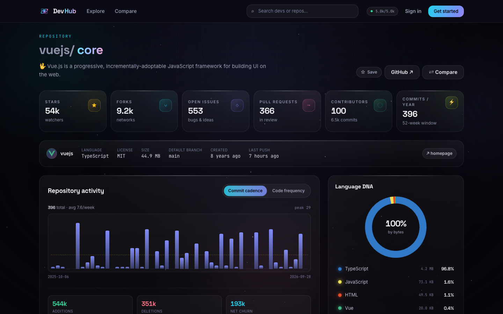
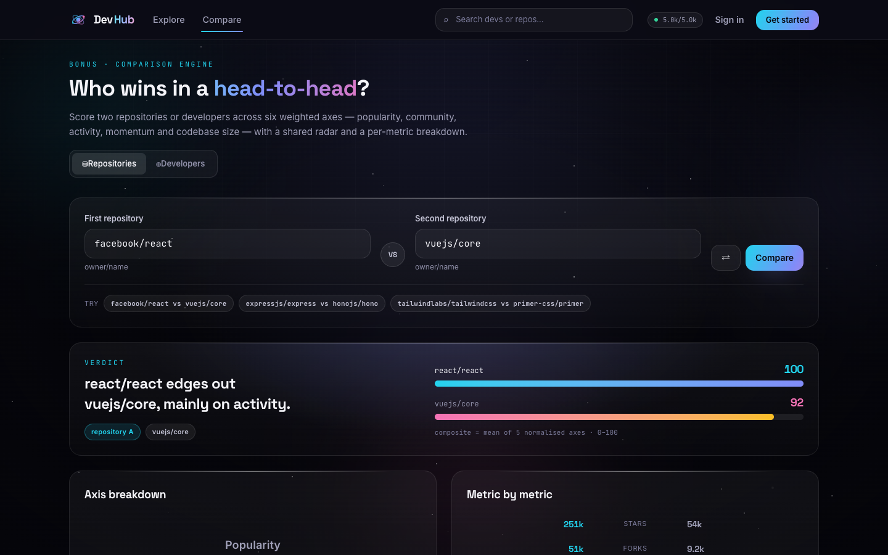
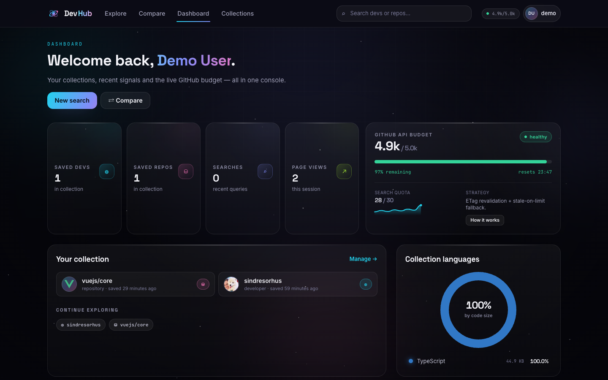

# DevHub · GitHub Developer & Repository Analytics

<p align="center">
  <strong>Search the GitHub graph, profile any developer or repository, compare them head-to-head — and keep your own curated collections.</strong>
</p>

<p align="center">
  <a href="https://devhub-analytics.onrender.com"><strong>🟢 Live demo</strong></a> ·
  <a href="#-quick-start">Quick start</a> ·
  <a href="#-features">Features</a> ·
  <a href="#-rest-api">REST API</a> ·
  <a href="#-architecture">Architecture</a> ·
  <a href="#-deployment">Deployment</a>
</p>

<p align="center">
  <a href="https://devhub-analytics.onrender.com"></a>
  
  
</p>

---

## ✨ Overview

DevHub is a full-stack analytics playground built on top of the public GitHub API.
It turns raw GitHub responses into **normalised, chart-ready domain data** — stars,
forks, issues, languages, contribution calendars, commit cadence — and wraps it in a
dark, glass-and-gradient interface designed to feel like a mission-control console.

|              |                                                                                                                    |
| ------------ | ------------------------------------------------------------------------------------------------------------------ |
| **Frontend** | React 19 · TypeScript (strict) · Vite 7 · Tailwind v4 · TanStack Query 5 · React Router 7                          |
| **Backend**  | Node 24+ · Express 5 · Zod validation · better-sqlite3 · bcryptjs · JWT (httpOnly cookie)                          |
| **Data**     | GitHub REST + GraphQL, ETag revalidation, SQLite response cache with stale-while-revalidate                        |
| **Quality**  | `tsc --noEmit` on both packages, Prettier, GitHub Actions CI, Lighthouse 100/100/100 (A11y · Best Practices · SEO) |

---

## 🚀 Quick start

```bash
# 1. clone and install (npm workspaces: server + client)
git clone <your-repo-url> devhub && cd devhub
npm install

# 2. configure the server
cp server/.env.example server/.env
#    → put a GitHub token in GITHUB_TOKEN (optional but strongly recommended)
#    → put a long random string in JWT_SECRET

# 3. run both apps in watch mode (API :4000, web :5173)
npm run dev
```

Open **http://localhost:5173** — the Vite dev server proxies `/api` to Express.

```bash
npm run build       # tsc → server/dist + vite build → client/dist
npm start           # one process serving API + SPA on :4000
npm run typecheck   # strict type check for both workspaces
npm run format      # Prettier write
```

> **No GitHub token?** Everything still works, with a 60 requests/hour budget and
> aggressive caching. With a token you get 5,000/hour plus GraphQL (contribution calendars).

---

## 🧭 Features

**Core requirements**

- **Authentication** — register / sign in / sign out, bcrypt-hashed passwords, JWT
  sessions in an `httpOnly` cookie (optional `Authorization: Bearer` support).
- **Search** — query GitHub users _and_ repositories with pagination, sort options,
  language filters, and result counts; queries are recorded to your account.
- **Developer profile** — bio, socials, followers/repos/stars, language donut,
  12-month contribution heatmap, repository grid, follower/earnings radar.
- **Repository page** — stars, forks, open issues vs. pull requests, contributors,
  topics, license, commit cadence, code-frequency (additions/deletions), language DNA,
  top contributors and latest commits.
- **Statistics** — every number is rendered through purpose-built SVG charts:
  donut, bars, code frequency, contribution heatmap, radar, sparkline.
- **Collections** — star any developer or repository; favourites persist server-side
  in SQLite and appear on the dashboard and the collections page.
- **Dashboard** — saved counts, recent views and searches, collection language mix,
  most-followed developers, trending repositories, and the live GitHub API budget.
- **REST API** — every page is powered by documented JSON endpoints (below).
- **Persistence** — SQLite (`server/data/devhub.db`) stores users, favourites,
  recent views, search history and the GitHub response cache.
- **Responsive UI** — mobile navigation drawer, fluid grids, and a design system of
  glass surfaces, chips, stat tiles and skeletons.
- **Loading & error states** — skeletons everywhere, empty states, typed API errors,
  a boundary-level "runtime fault" screen, and a friendly 404.

**Bonus features**

- 🆚 **Repository comparison** — two repos scored on five normalised axes with a
  shared radar and a metric-by-metric table.
- 👥 **Developer comparison** — six axes including consistency and longevity, with a
  written verdict ("sindresorhus takes it — consistency is the deciding axis").
- ⚡ **API caching + rate-limit handling** — ETag conditional requests (a `304`
  costs no quota), a 24 h stale-while-revalidate SQLite cache, per-resource rate
  budgets (`core` / `search`), a stop-hitting-GitHub buffer, and stale responses
  served when GitHub says we're limited.

---

## 📸 Demo

**[60-second walkthrough (MP4)](docs/demo.mp4)** · **[animated GIF](docs/demo.gif)** —
landing → search → developer profile → repository analytics → repository & developer
comparison → sign in → dashboard → collections.

<p align="center"><a href="docs/demo.mp4"></a></p>

Both are generated by `tools/demo.mjs`, which replays a scripted product tour against a
running DevHub instance and captures frames at 4 fps; `tools/capture.mjs` produces the
stills below (both use `puppeteer-core` against your installed Chrome):

```bash
npm run dev                    # terminal 1 — app must be running
npm run -w tools screenshots   # → docs/screenshots/*.png
npm run -w tools demo          # → tools/.frames/*.png (240 frames = 60 s)

# assemble (needs ffmpeg on PATH)
ffmpeg -framerate 4 -i tools/.frames/frame_%04d.png -vf format=yuv420p \
       -c:v libx264 -crf 24 -movflags +faststart docs/demo.mp4
ffmpeg -framerate 4 -i tools/.frames/frame_%04d.png \
       -vf "scale=1000:-1:flags=lanczos,split[s0][s1];[s0]palettegen[p];[s1][p]paletteuse" \
       -loop 0 docs/demo.gif
```

## 🗺️ Screenshots

> Screenshots live in [`docs/screenshots/`](docs/screenshots) and the 60-second demo
> GIF in [`docs/demo.gif`](docs/demo.gif).

| Landing                                  | Explore                                  | Developer profile                            |
| ---------------------------------------- | ---------------------------------------- | -------------------------------------------- |
|  |  |  |

| Repository                                     | Compare                                  | Dashboard                                    |
| ---------------------------------------------- | ---------------------------------------- | -------------------------------------------- |
|  |  |  |

---

## 🏗️ Architecture

```
devhub/
├── server/                     # Express 5 + TypeScript (ESM)
│   ├── src/
│   │   ├── app.ts              # middleware, routers, SPA fallback
│   │   ├── index.ts            # bootstrap + graceful shutdown
│   │   ├── config.ts           # env parsing, prod safety checks
│   │   ├── db/                 # schema, connection, migrations-on-boot
│   │   ├── lib/                # errors, http helpers, logger
│   │   ├── middleware/         # auth (JWT), rate limiting
│   │   ├── routes/             # auth · collections · dashboard · github · compare
│   │   ├── services/
│   │   │   ├── github/         # client (ETag + rate state), normalise, search…
│   │   │   ├── cache.ts        # TTL cache, SWR, stale-on-limit
│   │   │   ├── compare.ts      # bonus: scoring engines
│   │   │   ├── auth.service.ts # bcrypt + JWT
│   │   │   └── collections.service.ts
│   │   └── types/domain.ts     # normalised GitHub domain types
│   └── data/devhub.db          # gitignored SQLite file
└── client/                     # React 19 + Vite + Tailwind v4
    └── src/
        ├── pages/              # Landing · Explore · Developer · Repository ·
        │                       # Compare · Dashboard · Collections · Auth · 404
        ├── components/
        │   ├── charts/         # hand-built SVG charts (no chart library)
        │   ├── github/         # cards, favourite button, panels, cache badge
        │   ├── layout/         # navbar, footer, background, error boundary
        │   └── ui/             # buttons, fields, chips, skeletons, states
        ├── lib/                # api client, react-query hooks, auth, toasts
        └── styles/index.css    # design tokens + utility system
```

**Why normalise server-side?** Raw GitHub payloads are huge and inconsistent
(`forks_count` vs `forks`, `open_issues` mixing PRs in). `services/github/normalise.ts`
maps everything onto a stable `DevProfile` / `RepoSummary` / `DevBundle` shape, so the
client has one contract to type-check against and the payload is 5–10× smaller.

**Rendering pipeline**

```
Browser → React page → TanStack Query (dedupe/refresh) → /api/* → service layer
        → cache.ts (fresh? → return) → github client (ETag revalidate) → GitHub API
        → normalise → JSON envelope { data, meta }
```

`meta` carries cache provenance (`source: 'network' | 'cache' | 'stale'`) and rate-limit
headers, which the UI surfaces as a small **cached · 9s ago** badge.

---

## 🔑 Environment variables

| Variable          | Default                  | Purpose                                                        |
| ----------------- | ------------------------ | -------------------------------------------------------------- |
| `PORT`            | `4000`                   | API port                                                       |
| `NODE_ENV`        | `development`            | Enables secure cookies + strict checks in `production`         |
| `DATABASE_PATH`   | `server/data/devhub.db`  | SQLite location (mount a volume when containerised)            |
| `GITHUB_TOKEN`    | —                        | 60 → 5,000 REST requests/hour + GraphQL                        |
| `GITHUB_API_BASE` | `https://api.github.com` | Override for mocks / GHE                                       |
| `JWT_SECRET`      | dev fallback             | **Required in production** — server refuses to boot without it |
| `JWT_EXPIRES_IN`  | `7d`                     | Session lifetime                                               |
| `COOKIE_SECURE`   | `true` in prod           | `SameSite=None; Secure` for cross-site deploys                 |
| `CORS_ORIGINS`    | —                        | Allow-list for split client/server hosting                     |
| `APP_URL`         | `http://localhost:5173`  | Public URL used in logs                                        |
| `RATE_LIMIT_MAX`  | `240`/min                | Our own per-IP limiter                                         |
| `TRUST_PROXY`     | `true` in prod           | Honour `X-Forwarded-For` behind Render/nginx                   |

Copy `server/.env.example` → `server/.env` to start.

---

## 📡 REST API

All endpoints are mounted under `/api` and answer with an envelope:
`{ "data": …, "meta"?: { source, cachedAt, rateLimit… } }`.
Errors use `{ "error": { code, message, details? } }`.

### Auth — `/api/auth`

| Method  | Path        | Auth   | Description                                                                |
| ------- | ----------- | ------ | -------------------------------------------------------------------------- |
| `POST`  | `/register` | —      | Create account + session (`email`, `username`, `password`, `displayName?`) |
| `POST`  | `/login`    | —      | Sign in with email **or** username                                         |
| `POST`  | `/logout`   | —      | Clear the session cookie                                                   |
| `GET`   | `/me`       | cookie | Current user (`401` when anonymous)                                        |
| `PATCH` | `/profile`  | ✔      | Update display name                                                        |

### Collections — `/api/collections`

| Method   | Path                          | Auth | Description                                                 |
| -------- | ----------------------------- | ---- | ----------------------------------------------------------- |
| `GET`    | `/favorites`                  | ✔    | All saved developers & repositories                         |
| `POST`   | `/favorites`                  | ✔    | Save `{ kind: 'developer' \| 'repository', ref, snapshot }` |
| `DELETE` | `/favorites?kind=&ref=`       | ✔    | Remove from collection                                      |
| `GET`    | `/favorites/check?kind=&ref=` | ✔    | Boolean membership probe                                    |

### Dashboard — `/api/dashboard`

| Method | Path        | Auth | Description                                                             |
| ------ | ----------- | ---- | ----------------------------------------------------------------------- |
| `GET`  | `/`         | ✔    | Counts, favourites, recent views/searches, language mix, top developers |
| `POST` | `/views`    | ✔    | Record a profile/repository view                                        |
| `POST` | `/searches` | ✔    | Record a search query                                                   |

### GitHub data — `/api/github`

| Method | Path                                                  | Description                                                                    |
| ------ | ----------------------------------------------------- | ------------------------------------------------------------------------------ |
| `GET`  | `/search/users?q=&page=&perPage=&sort=`               | Developer search                                                               |
| `GET`  | `/search/repositories?q=&page=&perPage=&sort=&order=` | Repository search                                                              |
| `GET`  | `/trending?period=daily\|weekly\|monthly`             | Trending repositories                                                          |
| `GET`  | `/users/:username`                                    | Developer bundle (profile + languages + activity)                              |
| `GET`  | `/users/:username/profile`                            | Profile only                                                                   |
| `GET`  | `/users/:username/repos?sort=`                        | Repositories (normalised)                                                      |
| `GET`  | `/users/:username/activity`                           | Contribution calendar (GraphQL)                                                |
| `GET`  | `/repos/:owner/:repo`                                 | Repository bundle (details, languages, commits, contributors, issue breakdown) |
| `GET`  | `/repos/:owner/:repo/summary`                         | Lightweight payload for cards/comparison                                       |
| `GET`  | `/rate-limit`                                         | Live quota, cache stats, strategy                                              |

### Comparison — `/api/compare` (bonus)

| Method | Path                                      | Description                            |
| ------ | ----------------------------------------- | -------------------------------------- |
| `GET`  | `/repositories?a=owner/repo&b=owner/repo` | Five-axis score, verdict, metric table |
| `GET`  | `/developers?a=login&b=login`             | Six-axis score, verdict, metric table  |

### Diagnostics

| Method | Path          | Description                                    |
| ------ | ------------- | ---------------------------------------------- |
| `GET`  | `/api/health` | Uptime, environment, cache stats, token status |

**Example**

```bash
curl 'http://localhost:4000/api/compare/repositories?a=facebook/react&b=vuejs/core'
# → { "data": { "verdict": "react/react edges out vuejs/core, mainly on activity.", … } }
```

---

## ⚡ Caching & rate-limit strategy

1. **ETag revalidation** — every GitHub response's `ETag` is stored; the next request
   is conditional. `304 Not Modified` re-uses the cached body and **does not decrement**
   the remaining quota.
2. **TTL + stale-while-revalidate** — entries are fresh for a few minutes and can be
   served stale for up to 24 h while a background revalidation runs.
3. **Per-resource budgets** — `core` and `search` are tracked separately (GitHub limits
   them separately), including reset timestamps.
4. **Stop buffer** — when remaining requests drop below `minRemainingBuffer`, DevHub
   stops calling GitHub entirely and serves stale data instead of burning the quota.
5. **Stale-on-limit** — if GitHub answers `403/429` with a rate-limit header, the
   freshest cached copy is served and the UI shows it as stale.
6. **Our own limiter** — `express-rate-limit` protects the DevHub API itself
   (240 req/min/IP by default).

Cache stats and the live budget are visible on the dashboard and via `/api/health`.

---

## 🧪 Quality checks

```bash
npm run typecheck     # strict TS across server + client
npm run format:check  # Prettier
npm run build         # production bundles
```

CI (`.github/workflows/ci.yml`) runs install → typecheck → build → format check on
every push and pull request.

Lighthouse on the landing and repository pages: **Accessibility 100 · Best Practices 100 · SEO 100**.

---

## ☁️ Deployment

**🟢 Live: [https://devhub-analytics.onrender.com](https://devhub-analytics.onrender.com)** —
deployed from this repository with the [Render Blueprint](render.yaml) at the repo root
(`build: npm ci --include=dev && npm run build`, `start: npm start`,
health check `/api/health`). Pushing to `main` auto-deploys.

The production build is a **single service**: Express serves `client/dist` with SPA
fallback, so one web service is enough.

**Render / Railway / Fly.io**

```bash
build:  npm ci --include=dev && npm run build   # tsc/vite/tailwind are devDependencies
start:  npm start
```

Set `JWT_SECRET`, `GITHUB_TOKEN`, `NODE_ENV=production`, and mount a persistent disk at
`server/data` (or set `DATABASE_PATH` to a mounted volume) so SQLite survives redeploys.

**Split hosting (Vercel/Netlify + API)**

- Deploy `client/` as a static site with `VITE_API_PROXY` unset and a re-write of
  `/api/*` to the API URL, **or** build the client and let Express serve it.
- Set `CORS_ORIGINS=https://your-web.vercel.app` and
  `COOKIE_SECURE=true` so the session cookie is accepted cross-site.

**Docker**

```bash
docker build -t devhub .
docker run -p 4000:4000 -e JWT_SECRET=... -e GITHUB_TOKEN=... -v devhub-data:/app/server/data devhub
```

---

## 🗺️ Roadmap

- OAuth sign-in with GitHub (replaces username/password for one click)
- Organization profiles and team analytics
- Shareable public collections + Markdown export
- Background refresh worker for saved repositories
- Dark/light theme toggle (tokens are already scoped)

---

## 📜 License

MIT — see [LICENSE](LICENSE). Data © GitHub; DevHub is not affiliated with GitHub.
